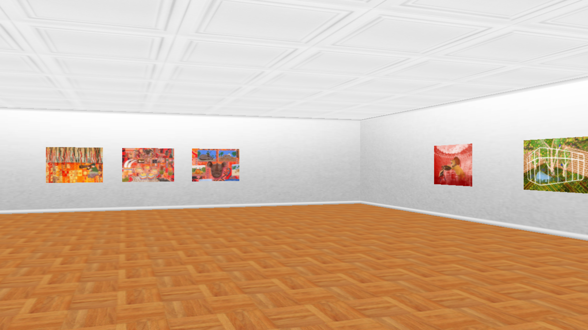

# We see ourselves in the cage: The History of the Zoo and the Changing Power Relations in Human Society

Animals are the closest living things to human beings. The evolution of our interactions with nonhuman animals is a natural outgrowth of our own social dynamics and an expression of our highest ideals. The evolution of zoos is the best example of how power dynamics have shifted over the course of human history. When a human and an animal look at each other, they are, in effect, staring into a mirror.

[Go to the website](https://forestlet.github.io/Art-Cage)

